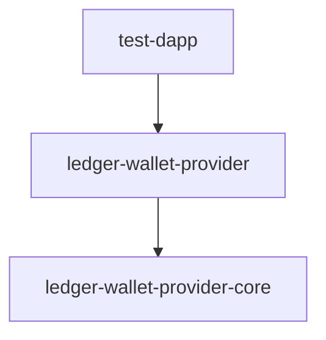

# Ledger Wallet Provider

A comprehensive monorepo for Ledger's Web3 integration components, providing seamless hardware wallet connectivity for web applications.

## 🚀 Overview

Ledger Wallet Provider is a modern monorepo built with **Nx**, **pnpm**, and **TypeScript** that provides:

- **Web Components** for easy integration into any web framework
- **Core SDK** for advanced wallet management and transaction signing
- **Test DApp** for development and testing
- **Framework-agnostic** design with support for React, Angular, Vue, and vanilla JavaScript

## 📦 Packages

### Core Packages

| Package | Description | Version |
|---------|-------------|---------|
| [`@ledgerhq/ledger-wallet-provider`](./packages/ledger-button) | Main Web Component library with UI components | `1.0.0-rc.5` |
| [`@ledgerhq/ledger-wallet-provider-core`](./packages/ledger-button-core) | Core SDK for wallet management and transaction signing | `1.0.0-rc.5` |

### Applications

| Application | Description |
|-------------|-------------|
| [`test-dapp`](./apps/test-dapp) | Next.js test application for development and testing |


## 🛠️ Tech Stack

- **Monorepo Management**: [Nx](https://nx.dev)
- **Package Manager**: [pnpm](https://pnpm.io) with workspace support
- **Toolchain Management**: [prototools](https://moonrepo.dev/docs/proto) for development environment setup
- **Build System**: [Vite](https://vitejs.dev) for fast builds
- **Testing**: [Vitest](https://vitest.dev) for unit tests, [Playwright](https://playwright.dev) for E2E
- **UI Framework**: [Lit](https://lit.dev) for Web Components
- **Styling**: [Tailwind CSS](https://tailwindcss.com) with [CVA](https://cva.style)
- **TypeScript**: 5.8.3 with strict configuration
- **Linting**: ESLint with TypeScript support
- **Documentation**: Storybook for component documentation

## 🚀 Quick Start

### Prerequisites

- **Node.js**: 18+ (recommended: 20+)
- **pnpm**: Latest version

### Usage with prototools

For an easier setup, install [prototools](https://moonrepo.dev/docs/proto/install).
Once installed, the prerequisite tools can be easily installed using:
```bash
cd ledger-wallet-provider
proto use
```

The command `proto use` will look into the `.prototools` file and install the required version of the tools needed (node, pnpm). For more information, see the [prototools documentation](https://moonrepo.dev/docs/proto).

### Installation

```bash
# Clone the repository
git clone https://github.com/LedgerHQ/ledger-button.git ledger-wallet-provider
cd ledger-wallet-provider

# Install dependencies
pnpm install
```

### Development

```bash
# Build the main package
pnpm nx run build ledger-wallet-provider

# Start the test DApp
pnpm nx run dev test-dapp

# Run Storybook for component documentation
pnpm nx run storybook ledger-wallet-provider
```

## 📋 Available Scripts

### Workspace Commands

```bash
# Package-specific commands
pnpm nx run <command> ledger-wallet-provider          # Run commands for @ledgerhq/ledger-wallet-provider
pnpm nx run <command> ledger-wallet-provider-core     # Run commands for @ledgerhq/ledger-wallet-provider-core
pnpm nx run <command> test-dapp                       # Run commands for test-dapp
```

### Build & Test

```bash
# Build all packages
pnpm nx run-many -t build

# Run tests
pnpm nx run-many -t test

# Run linting
pnpm nx run-many -t lint

# Run typecheck
pnpm nx run-many -t typecheck
```

### Release Management

```bash
# Version management
pnpm version:patch              # Patch version bump
pnpm version:minor              # Minor version bump
pnpm version:major              # Major version bump
pnpm version:prerelease         # Prerelease version

# Release
pnpm release                    # Publish packages
```

## 🏗️ Architecture

### Monorepo Structure

```
ledger-wallet-provider/
├── packages/                  # Published packages
│   ├── ledger-button/         # Main Web Component library
│   └── ledger-button-core/    # Core SDK
├── apps/                      # Applications
│   └── test-dapp/            # Next.js test application
└── tools/                    # Development tools
    └── danger/               # Danger.js configuration
```

### Package Dependencies



## 🔧 Development

### Adding New Packages

```bash
# Generate a new library
pnpm nx g @nx/js:lib packages/my-new-lib --publishable --importPath=@ledgerhq/my-new-lib

# Generate a new application
pnpm nx g @nx/next:app apps/my-new-app
```

### Code Quality

The project uses several tools to maintain code quality:

- **ESLint**: Code linting with TypeScript support
- **Prettier**: Code formatting
- **Danger.js**: Automated code review
- **Conventional Commits**: Standardized commit messages
- **Gitmoji**: Emoji-based commit messages

### Testing Strategy

- **Unit Tests**: Vitest for fast unit testing
- **Component Tests**: Storybook test runner
- **E2E Tests**: Playwright for end-to-end testing
- **Visual Regression**: Storybook visual testing

## 📚 Documentation

- **Component Documentation**: [Storybook](./packages/ledger-button/storybook-static)
- **API Documentation**: Generated from TypeScript definitions
- **Examples**: Available in the test-dapp application

## 🤝 Contributing

1. **Fork** the repository
2. **Create** a feature branch: `git checkout -b feature/amazing-feature`
3. **Commit** your changes: `git commit -m '✨ Add amazing feature'`
4. **Push** to the branch: `git push origin feature/amazing-feature`
5. **Open** a Pull Request

### Commit Convention

This project uses [Conventional Commits](https://conventionalcommits.org) with [Gitmoji](https://gitmoji.dev):

```bash
✨ Add new feature
🐛 Fix bug
📝 Update documentation
🎨 Improve code structure
```

## 📄 License

This project is licensed under the APACHE 2.0 License - see the [LICENSE](./LICENSE) file for details.

## 🔗 Links

- **Nx Documentation**: [nx.dev](https://nx.dev)
- **pnpm Documentation**: [pnpm.io](https://pnpm.io)
- **prototools Documentation**: [moonrepo.dev](https://moonrepo.dev/docs/proto)
- **Lit Documentation**: [lit.dev](https://lit.dev)
- **Tailwind CSS**: [tailwindcss.com](https://tailwindcss.com)

## 🆘 Support

For support and questions:

- **Issues**: [GitHub Issues](https://github.com/LedgerHQ/ledger-button/issues)
- **Discussions**: [GitHub Discussions](https://github.com/LedgerHQ/ledger-button/discussions)

---

Built with ❤️ by the Ledger team